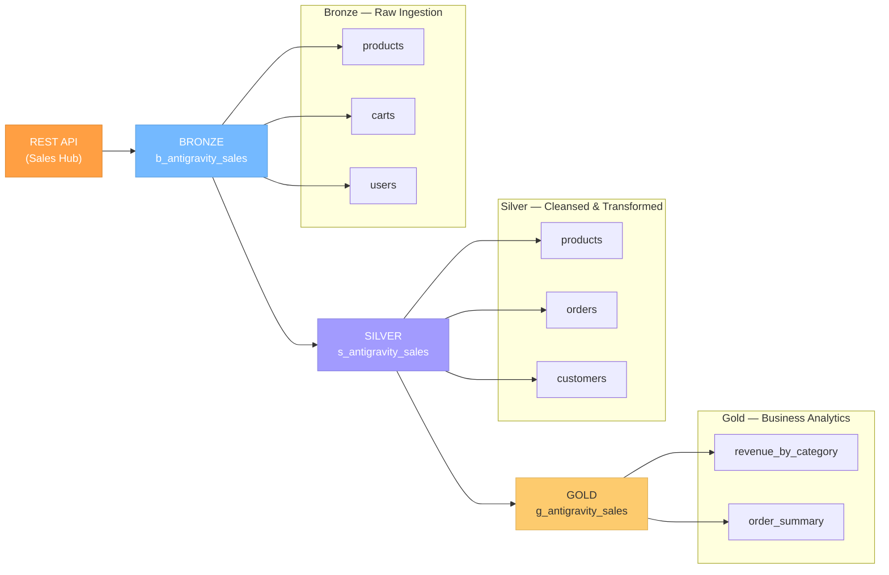

# AI-Powered Pipeline Accelerator — Demo

## What You're About To See

An AI agent that reads technical specifications and **automatically generates production-ready data pipelines** — complete with code, tests, and documentation.

---

## Demo Flow

```mermaid
graph LR
    A["1. Business\nRequirement"] --> B["2. Technical\nSpecifications"]
    B --> C["3. AI Generates\nPipeline Code"]
    C --> D["4. AI Generates\nUnit Tests"]
    D --> E["5. Run Tests"]
    E --> F["6. Fix Failed\nTests"]
    F --> G["7. Push to\nGit"]
    G --> H["8. Deploy to\nDatabricks"]
    H --> I["9. Run\nPipeline"]
    I --> J["10. View\nData"]

    style A fill:#4A90D9,stroke:#2E6BA6,color:#fff
    style B fill:#4A90D9,stroke:#2E6BA6,color:#fff
    style C fill:#50C878,stroke:#3A9D5C,color:#fff
    style D fill:#50C878,stroke:#3A9D5C,color:#fff
    style E fill:#50C878,stroke:#3A9D5C,color:#fff
    style F fill:#FFD93D,stroke:#CCB030,color:#333
    style G fill:#50C878,stroke:#3A9D5C,color:#fff
    style H fill:#FF9F43,stroke:#E08930,color:#fff
    style I fill:#FF9F43,stroke:#E08930,color:#fff
    style J fill:#FF9F43,stroke:#E08930,color:#fff
```



*(Note: If the diagram above is not rendering, install the **Markdown Preview Mermaid Support** extension in your IDE, or view the text-based flow below)*

```text
[1. Business Req] ──> [2. Technical Specs] ──> [3. AI Code Gen]
                                                      │
                                                      ▼
[7. Git Push] ◄── [6. Fix Tests] ◄── [5. Run Tests] ◄── [4. Unit Tests]
      │
      ▼
[8. Deploy Databricks] ──> [9. Run Pipeline] ──> [10. View Data]
```

| Step | What Happens | Who Does It |
|------|-------------|-------------|
| 1 | Define and provide the business requirement document | Business Team |
| 2 | Write three technical specs (Bronze, Silver, Gold) | Data Engineer |
| 3 | Ask AI to generate Bronze, Silver, Gold pipeline code | AI Agent |
| 4 | Ask AI to generate unit tests | AI Agent |
| 5 | Run tests to validate generated code | AI Agent |
| 6 | Ask AI to fix any failed tests | AI Agent |
| 7 | Ask AI to commit and push to GitHub | AI Agent |
| 8 | Deploy latest code to Databricks via Git Repos | CI/CD Pipeline |
| 9 | Run the pipeline notebooks (Bronze → Silver → Gold) | CI/CD Pipeline |
| 10 | Query Gold tables to view business insights | Data Engineer |

---

## Deploying & Running in Databricks

### Step 8 — Pull Code from Git to Databricks

1. Open **Databricks Workspace → Repos**
2. If the repo is already linked, click **Pull** to sync the latest changes from the `antigravity-migration` branch
   - If not yet linked: click **Add Repo**, paste the GitHub URL (`https://github.com/Yenugutala/antigravity-dev-assistant.git`), and select the `antigravity-migration` branch
3. The repo now mirrors the generated pipeline code — no manual file uploads needed

### Step 9 — Run the Pipeline

Run the notebooks **in order** from the Databricks Repos folder:

| Order | Notebook | What It Does |
|-------|----------|-------------|
| 1 | `notebooks/run_pipeline.py` | Orchestrator — runs Bronze, Silver, and Gold in sequence |

Or run each layer individually:

| Order | Notebook | What It Does |
|-------|----------|-------------|
| 1 | `src/pipelines/sales/orders/bronze_ingest.py` | Ingests raw data from Sales Hub REST API into Bronze tables |
| 2 | `src/pipelines/sales/orders/silver_cleanse.py` | Cleanses, deduplicates, and transforms into Silver tables |
| 3 | `src/pipelines/sales/orders/gold_aggregate.py` | Aggregates into Gold business metrics tables |

### Step 10 — View the Data

After the pipeline completes, query the Gold tables directly in a Databricks notebook or SQL editor:

```sql
-- Revenue by product category
SELECT * FROM g_antigravity_sales.revenue_by_category ORDER BY total_revenue DESC;

-- Order summary with customer details
SELECT * FROM g_antigravity_sales.order_summary LIMIT 20;
```

You can also explore intermediate tables:

```sql
-- Silver: cleansed products
SELECT * FROM s_antigravity_sales.products LIMIT 10;

-- Bronze: raw ingested data
SELECT * FROM b_antigravity_sales.products LIMIT 10;
```

---

## Architecture: Medallion Pipeline



*(Note: If the diagram above is not rendering, install the **Markdown Preview Mermaid Support** extension in your IDE, or view the text-based architecture below)*

```text
  REST API (Sales Hub)
         │
         ▼
  BRONZE Layer  (b_antigravity_sales)   :  products, carts, users
         │
         ▼
  SILVER Layer  (s_antigravity_sales)   :  products, orders (exploded/enriched), customers, orders_quarantine
         │
         ▼
  GOLD Layer    (g_antigravity_sales)   :  revenue_by_category, order_summary
```

---

## Technology Stack

| Layer | Technology | Purpose |
|-------|-----------|---------|
| Compute | Azure Databricks | Cloud data platform |
| Storage | Delta Lake | Reliable table format |
| Bronze | PySpark + REST API | Raw data ingestion |
| Silver | Spark SQL | Cleansing & transformation |
| Gold | Spark SQL | Business aggregations |
| Testing | pytest | Automated unit tests |
| Version Control | GitHub | Code repository |
| AI Agent | Antigravity | Code generation |

---

## Key Takeaway

> **From business requirement to production pipeline in minutes — not weeks.**
>
> The AI reads specifications and generates all artifacts:
> pipeline code, unit tests, documentation, and orchestration notebooks.
