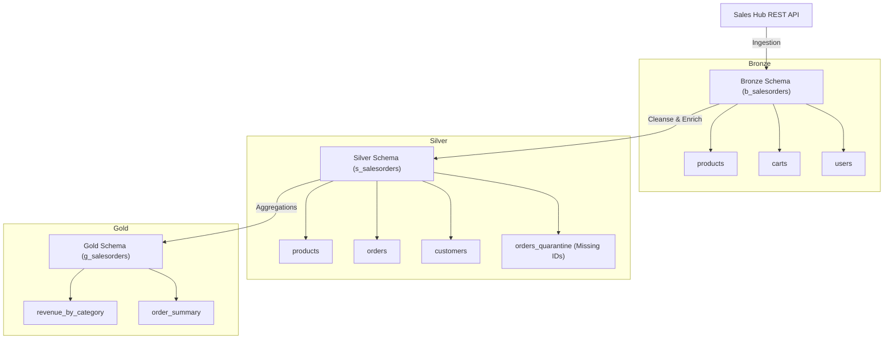

# High-Level Design (HLD): Sales Orders Medallion Pipeline

## Solution Overview
This document describes the high-level design of the Sales Orders data pipeline. The pipeline ingests raw transaction data from the Sales Hub REST API and processes it through a Medallion Architecture (Bronze → Silver → Gold) in Databricks.

## Architecture & Data Flow
The data flow model follows three distinct processing tiers:
1. **Bronze (Raw Ingestion)**: Ingests raw data from `/products`, `/carts`, and `/users` REST endpoints as-is with basic metadata columns.
2. **Silver (Cleanse & Transform)**: Cleanses fields (TRIM, LOWER, explicit numeric casts), explodes transaction cart arrays into individual order lines, enriches records with product metadata, and filters out malformed transactions into a quarantine destination.
3. **Gold (Business Aggregations)**: Calculates business-level aggregate tables for performance metrics and analytical reporting.

## Schema Catalogs

### Bronze Layer Tables
* **`b_salesorders.products`**: Raw records representing products.
* **`b_salesorders.carts`**: Raw transaction shopping carts containing arrays of items.
* **`b_salesorders.users`**: Raw buyer customer profiles.
* **Metadata Fields** (added automatically):
  - `_ingestion_timestamp` (ISO String)
  - `_source` (e.g. `"sales_hub_api"` or `"fallback_sample"`)
  - `_batch_id` (UUID)

### Silver Layer Tables
* **`s_salesorders.products`**: Cleansed products, deduplicated by `product_id`.
* **`s_salesorders.customers`**: Cleaned and flattened customer profile data, deduplicated by `customer_id`.
* **`s_salesorders.orders`**: Exploded lines of carts joined with cleansed products, deduplicated by `[cart_id, product_id]`.
* **`s_salesorders.orders_quarantine`**: Contains records rejected due to missing ID elements (`id IS NULL`).

### Gold Layer Tables
* **`g_salesorders.revenue_by_category`**: Aggregated financial metrics grouped by product category:
  - `total_revenue`
  - `total_items_sold`
  - `total_orders`
  - `avg_price`
  - `unique_products`
* **`g_salesorders.order_summary`**: Daily aggregation of sales:
  - `total_orders`
  - `unique_customers`
  - `total_revenue`
  - `total_items`
  - `avg_order_line_value`
